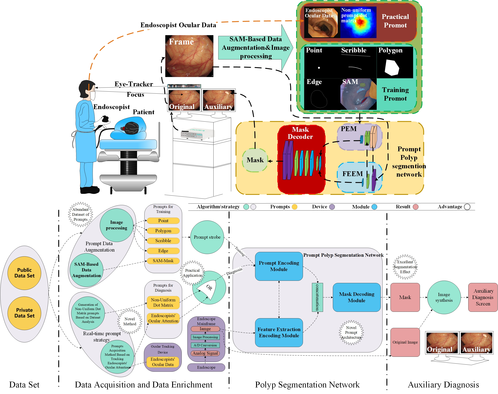

# PPSM-A Novel Prompt-based Polyp Segmentation Method in Endoscopic Images


Authors: [Xinzhen Ren](https://orcid.org/0000-0002-6320-3169) and [Wenju Zhou]

Links to the paper:
+ 

## 1. Overview

### 1.1 Abstract

Accurate segmentation of polyps in endoscopic images is crucial for the correct diagnosis of early cancer. However, accurate polyp segmentation is a challenge due to the similarity between polyps and surrounding tissues. A novel prompt-based polyp segmentation method (PPSM) for endoscopy is proposed, which is applied in practice by incorporating prompts such as the endoscopist's ocular attention, non-uniform dot matrix, or polyp features. Firstly, an introduced prompt-based polyp segmentation network (PPSN) contains three modules: prompt encoding module(PEM), the feature extraction encoding module (FEEM), and the mask decoding module (MDM). The PPSN achieves outstanding segmentation of polyps because the PEM encodes the prompts, guiding the FEEM to extract features in a targeted manner and instructing the MDM to generate masks directionally. The architecture of the network addresses challenges such as inadequate feature learning and overfitting. Secondly, endoscopists' ocular attention data are innovatively incorporated as inputs to the PEM to enhance accuracy in practical applications, thereby addressing the challenge of obtaining prompt data in real-world scenarios. The non-uniform dot matrix prompts, generated according to the probability of polyp occurrence, compensate for frame loss phenomena in the eye-tracking process, thus enhancing the stability of the method. Additionally, a data enhancement method based on the Segment Anything Model (SAM) is introduced to improve the prompt dataset and enhance the adaptability of PPSN. Experimental results demonstrate that the PPSM exhibits sensitivity to polyp features, achieving high real-time performance, accuracy, and strong adaptability.

### 1.2 Architecture



### 1.3 Qualitative results2. Usage

### 2.1 Preparation

+ Create and activate virtual environment:

```
python3 -m venv ~/PPSN-env
source ~/PPSN-env/bin/activate
```

+ Clone the repository and navigate to new directory:

```
git clone https://github.com
cd ./PPSN
```

+ Install the requirements:

```
pip install -r requirements.txt
```

+ Download and extract the [Kvasir-SEG](https://datasets.simula.no/downloads/kvasir-seg.zip) and the [CVC-ClinicDB](https://www.dropbox.com/s/p5qe9eotetjnbmq/CVC-ClinicDB.rar?dl=0) datasets.

+ Download the [PVTv2-B3](https://github.com/whai362/PVT/releases/download/v2/pvt_v2_b3.pth) weights to `./`

### 2.2 Training

Train PPSN on the train split of a dataset:

```
python train.py --dataset=[train data] --data-root=[path]
```

+ Replace `[train data]` with training dataset name (options: `Kvasir`; `CVC`).

+ Replace `[path]` with path to parent directory of `/images` and `/masks` directories (training on Kvasir-SEG); or parent directory of `/Original` and `/Ground Truth` directories (training on CVC-ClinicDB).

+ To train on multiple GPUs, include `--multi-gpu=true`.

### 2.3 Prediction&Testing

Generate predictions from a trained model for a test split. Note, the test split can be from a different dataset to the train split:

```
python predict.py --train-dataset=[train data] --test-dataset=[test data] --data-root=[path]
```

+ Replace `[train data]` with training dataset name (options: `Kvasir`; `CVC`).

+ Replace `[test data]` with testing dataset name (options: `Kvasir`; `CVC`).

+ Replace `[path]` with path to parent directory of `/images` and `/masks` directories (testing on Kvasir-SEG); or parent directory of `/Original` and `/Ground Truth` directories (testing on CVC-ClinicDB).

+ 

## 3. License

This repository is released under the Apache 2.0 license as found in the [LICENSE](h) file.

## 4. Citation

If you use this work, please consider citing us:

```bibtex

```

## 5. Commercial use


## 6. Acknowledgements


## 7. Additional information


