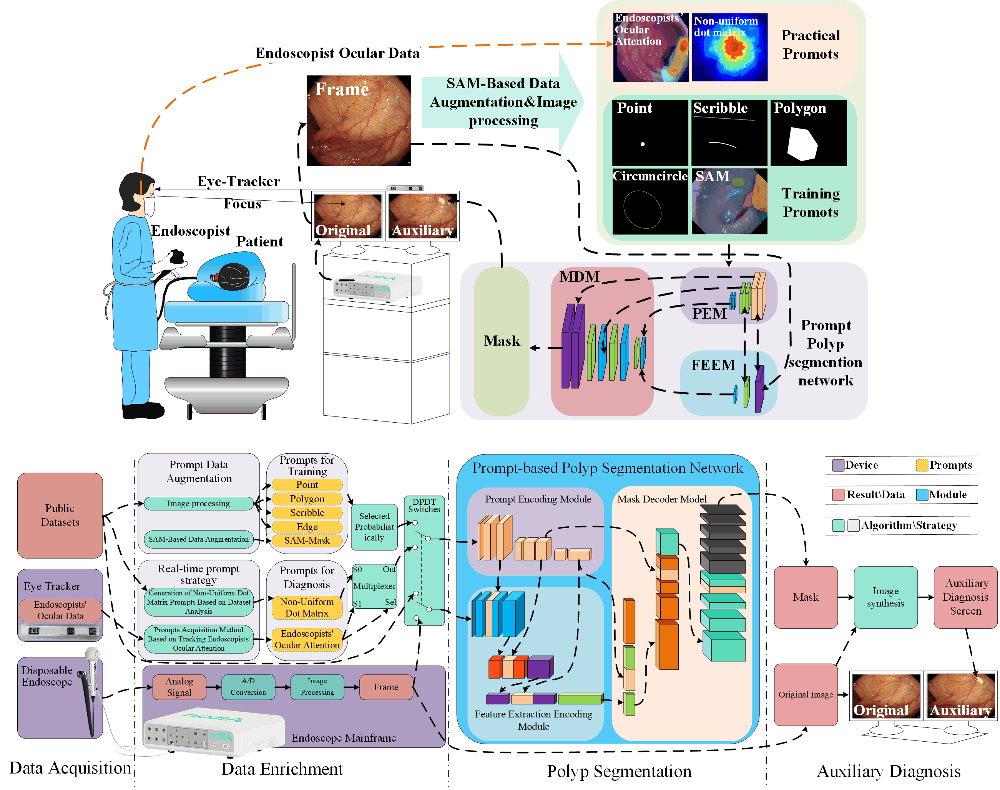
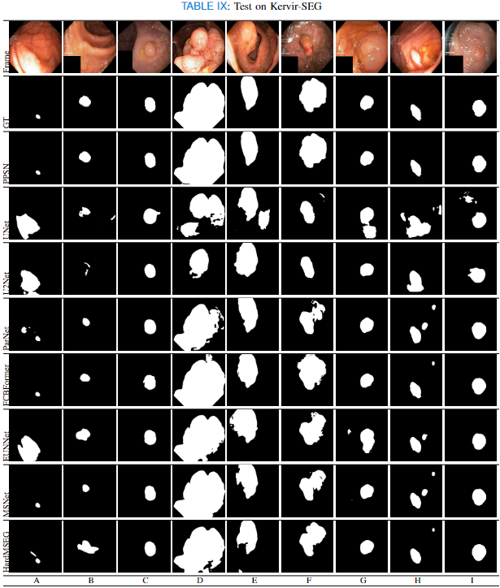
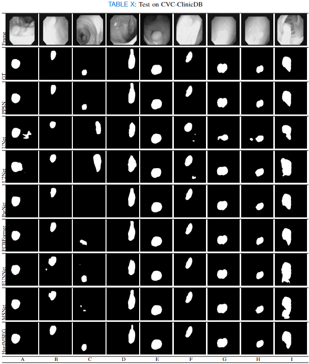
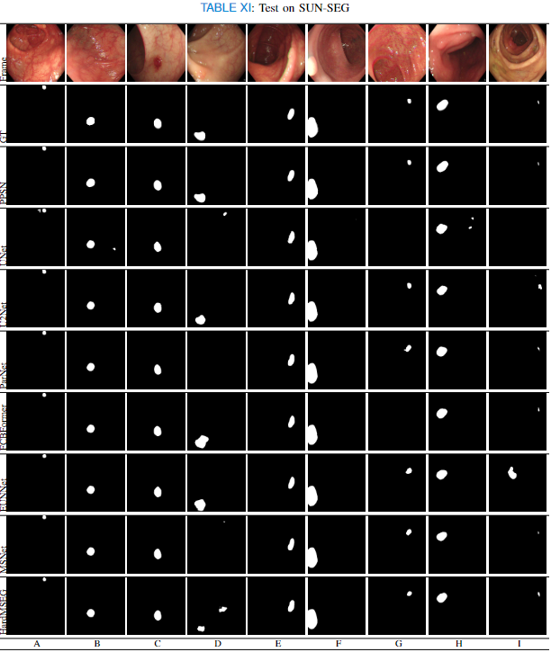
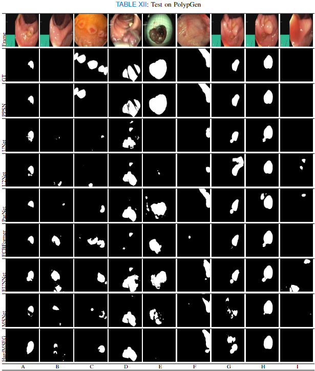

# PPSM-Prompt-based polyp segmentation during endoscopy

Authors: Xinzhen Ren, Wenju Zhou, Naitong Yuan, Fang Li, Yetian Ruan, and Huiyu Zhou.

## 1. Overview

### 1.1 Abstract

Accurate judgment and identification of polyp size is crucial in endoscopic diagnosis. However, the indistinct boundaries of polyps lead to missegmentation and missed cancer diagnoses. In this paper, a prompt-based polyp segmentation method (PPSM) is proposed to assist in early-stage cancer diagnosis during endoscopy. It combines endoscopists' experience and artificial intelligence technology. Firstly, a prompt-based polyp segmentation network (PPSN) is presented, which contains the prompt encoding module (PEM), the feature extraction encoding module (FEEM), and the mask decoding module (MDM). The PEM encodes prompts to guide the FEEM for feature extracting and the MDM for mask generating. So that PPSN can segment polyps efficiently. Secondly, endoscopists' ocular attention data (gazes) are used as prompts, which can enhance PPSN's accuracy for segmenting polyps and obtain prompt data effectively in real-world. To reinforce the PPSN's stability, non-uniform dot matrix prompts are generated to compensate for frame loss during the eye-tracking. Moreover, a data augmentation method based on the segment anything model (SAM) is introduced to enrich the prompt dataset and improve the PPSN's adaptability. Experiments demonstrate the PPSM's superior accuracy and real-time capability. The results from cross-training and cross-testing on four datasets show the PPSM's excellent generalization.

### 1.2 Architecture



### 1.3 Results

The images and performance  will be showed after the paper is accepted.









### 2. Usage

### 2.1 Preparation

+ Create and activate virtual environment:

```
python3 -m venv ~/PPSN-env
source ~/PPSN-env/bin/activate
```

+ Clone the repository and navigate to new directory:

```
git clone https://github.com
cd ./PPSN
```

+ Install the requirements:

```
pip install -r requirements.txt
```

You will need to download the dataset yourself

+ Download and extract the [Kvasir-SEG](https://datasets.simula.no/downloads/kvasir-seg.zip), the [CVC-ClinicDB](https://www.dropbox.com/s/p5qe9eotetjnbmq/CVC-ClinicDB.rar?dl=0), the [SUN-SEG](http://amed8k.sundatabase.org/) and the [PolyGen](https://www.synapse.org/#!Synapse:syn26376615/wiki/613312)  datasets.

The prompts can be generated in
`drawPrompts.py`

The SAM_Mask, SAM_Points, SAM_Polygons, and SAM_Scribbles generated by [SAM](https://github.com/facebookresearch/segment-anything).  We generated them base on ViT-B SAM model and screened them.

A dataset should have: original image(images, Frame), Ground Truth(GT), and Prompts (e.g. Circumcircle, Points....).


```
├─kvasir-seg
│  └─images
│  └─masks
│  └─Point
│  └─SAM
│  └─Polygon
│  └─Scribble
│  └─Circumcircle
├─CVC-ClinicDB
│  └─Ground Truth
│  └─Original
│  └─Point
│  └─SAM
│  └─Polygon
│  └─Scribble
│  └─Circumcircle
├─SUN
│  └─GT
│  └─Frame
│  └─Point
│  └─SAM
│  └─Polygon
│  └─Scribble
│  └─Circumcircle
├─polypGen2021_MultiCenterData_v3
│  └─imagesAll_mask
│  └─imagesAll
│  └─Point
│  └─SAM
│  └─Polygon
│  └─Scribble
│  └─Circumcircle
├─Data
│  └─__pycache__
├─Metrics
│  └─__pycache__
├─Models
│  └─__pycache__
├─Others
│  ├─CFANet-main
│  │  ├─imgs
│  │  ├─lib
│  │  ├─mindspore
│  │  │  ├─lib
│  │  │  └─utils
│  │  └─utils
│  │      └─__pycache__
│  ├─Enhanced-U-Net-main
│  │  ├─datasets
│  │  │  └─__pycache__
│  │  ├─models
│  │  │  └─__pycache__
│  │  └─utils
│  │      └─__pycache__
│  ├─FAPNet-main
│  │  ├─imgs
│  │  ├─lib
│  │  │  └─__pycache__
│  │  └─utils
│  ├─FSAD-Net-master
│  ├─Graph_Region_Boudnary-main
│  │  ├─lib
│  │  │  └─__pycache__
│  │  ├─model
│  │  ├─res_weight
│  │  └─utils
│  │      └─__pycache__
│  ├─HarDNet-MSEG-master
│  │  ├─eval
│  │  ├─imgs
│  │  ├─lib
│  │  └─utils
│  │      └─__pycache__
│  ├─MSNet-M2SNet-main
│  │  ├─image
│  │  ├─model
│  │  │  └─__pycache__
│  │  ├─utils
│  │  └─weight
│  ├─PraNet-master
│  │  ├─eval
│  │  ├─imgs
│  │  ├─jittor
│  │  │  ├─lib
│  │  │  └─utils
│  │  ├─lib
│  │  └─utils
│  │      └─__pycache__
└─Predictions
    ├─EUNet
    │  ├─Trained on CVC
    │  │  ├─test_on_CVC
    │  │  ├─test_on_Kvasir
    │  │  ├─test_on_polyGen
    │  │  └─test_on_SUN
    │  ├─Trained on Kvasir
    │  │  ├─test_on_CVC
    │  │  ├─test_on_Kvasir
    │  │  ├─test_on_polyGen
    │  │  └─test_on_SUN
    │  ├─Trained on polyGen
    │  │  ├─test_on_CVC
    │  │  ├─test_on_Kvasir
    │  │  ├─test_on_polyGen
    │  │  └─test_on_SUN
    │  └─Trained on SUN
    │      ├─test_on_CVC
    │      ├─test_on_Kvasir
    │      ├─test_on_polyGen
    │      └─test_on_SUN
    ├─FCBFormer
    │  ├─Trained on CVC
    │  │  ├─test_on_CVC
    │  │  ├─test_on_Kvasir
    │  │  ├─test_on_polyGen
    │  │  └─test_on_SUN
    │  ├─Trained on Kvasir
    │  │  ├─test_on_CVC
    │  │  ├─test_on_Kvasir
    │  │  ├─test_on_polyGen
    │  │  └─test_on_SUN
    │  ├─Trained on polyGen
    │  │  ├─test_on_CVC
    │  │  ├─test_on_Kvasir
    │  │  ├─test_on_polyGen
    │  │  └─test_on_SUN
    │  └─Trained on SUN
    │      ├─test_on_CVC
    │      ├─test_on_Kvasir
    │      ├─test_on_polyGen
    │      └─test_on_SUN
    ├─HarDMSEG
    │  ├─Trained on CVC
    │  │  ├─test_on_CVC
    │  │  ├─test_on_Kvasir
    │  │  ├─test_on_polyGen
    │  │  └─test_on_SUN
    │  ├─Trained on Kvasir
    │  │  ├─test_on_CVC
    │  │  ├─test_on_Kvasir
    │  │  ├─test_on_polyGen
    │  │  └─test_on_SUN
    │  ├─Trained on polyGen
    │  │  ├─test_on_CVC
    │  │  ├─test_on_Kvasir
    │  │  ├─test_on_polyGen
    │  │  └─test_on_SUN
    │  └─Trained on SUN
    │      ├─test_on_CVC
    │      ├─test_on_Kvasir
    │      ├─test_on_polyGen
    │      └─test_on_SUN
    ├─MSNet
    │  ├─Trained on CVC
    │  │  ├─test_on_CVC
    │  │  ├─test_on_Kvasir
    │  │  ├─test_on_polyGen
    │  │  └─test_on_SUN
    │  ├─Trained on Kvasir
    │  │  ├─test_on_CVC
    │  │  ├─test_on_Kvasir
    │  │  ├─test_on_polyGen
    │  │  └─test_on_SUN
    │  ├─Trained on polyGen
    │  │  ├─test_on_CVC
    │  │  ├─test_on_Kvasir
    │  │  ├─test_on_polyGen
    │  │  └─test_on_SUN
    │  └─Trained on SUN
    │      ├─test_on_CVC
    │      ├─test_on_Kvasir
    │      ├─test_on_polyGen
    │      └─test_on_SUN
    ├─PraNet
    │  ├─Trained on CVC
    │  │  ├─test_on_CVC
    │  │  ├─test_on_Kvasir
    │  │  ├─test_on_polyGen
    │  │  └─test_on_SUN
    │  ├─Trained on Kvasir
    │  │  ├─test_on_CVC
    │  │  ├─test_on_Kvasir
    │  │  ├─test_on_polyGen
    │  │  └─test_on_SUN
    │  ├─Trained on polyGen
    │  │  ├─test_on_CVC
    │  │  ├─test_on_Kvasir
    │  │  ├─test_on_polyGen
    │  │  └─test_on_SUN
    │  └─Trained on SUN
    │      ├─test_on_CVC
    │      ├─test_on_Kvasir
    │      ├─test_on_polyGen
    │      └─test_on_SUN
    ├─PPSN
    │  ├─Trained on CVC
    │  │  └─p0.6
    │  │      ├─test_on_CVC
    │  │      ├─test_on_Kvasir
    │  │      ├─test_on_polyGen
    │  │      └─test_on_SUN
    │  ├─Trained on Kvasir
    │  │  └─p0.6
    │  │      ├─test_on_CVC
    │  │      ├─test_on_Kvasir
    │  │      ├─test_on_polyGen
    │  │      └─test_on_SUN
    │  ├─Trained on polyGen
    │  │  └─p0.6
    │  │      ├─test_on_CVC
    │  │      ├─test_on_Kvasir
    │  │      ├─test_on_polyGen
    │  │      └─test_on_SUN
    │  └─Trained on SUN
    │      └─p0.6
    │          ├─test_on_CVC
    │          ├─test_on_Kvasir
    │          ├─test_on_polyGen
    │          └─test_on_SUN
    ├─U2Net
    │  ├─Trained on CVC
    │  │  ├─test_on_CVC
    │  │  ├─test_on_Kvasir
    │  │  ├─test_on_polyGen
    │  │  └─test_on_SUN
    │  ├─Trained on Kvasir
    │  │  ├─test_on_CVC
    │  │  ├─test_on_Kvasir
    │  │  ├─test_on_polyGen
    │  │  └─test_on_SUN
    │  ├─Trained on polyGen
    │  │  ├─test_on_CVC
    │  │  ├─test_on_Kvasir
    │  │  ├─test_on_polyGen
    │  │  └─test_on_SUN
    │  └─Trained on SUN
    │      ├─test_on_CVC
    │      ├─test_on_Kvasir
    │      ├─test_on_polyGen
    │      └─test_on_SUN
    ├─UNet
    │  ├─Trained on CVC
    │  │  ├─test_on_CVC
    │  │  ├─test_on_Kvasir
    │  │  ├─test_on_polyGen
    │  │  └─test_on_SUN
    │  ├─Trained on Kvasir
    │  │  ├─test_on_CVC
    │  │  ├─test_on_Kvasir
    │  │  ├─test_on_polyGen
    │  │  └─test_on_SUN
    │  ├─Trained on polyGen
    │  │  ├─test_on_CVC
    │  │  ├─test_on_Kvasir
    │  │  ├─test_on_polyGen
    │  │  └─test_on_SUN
    │  └─Trained on SUN
    │      ├─test_on_CVC
    │      ├─test_on_Kvasir
    │      ├─test_on_polyGen
    │      └─test_on_SUN
    └─UNet++
        ………………………………………………………………
```

## 3. About equipment

The intellectual property rights of the disposable electronic endoscopes, image processor, and eye tracker  were transferred to a Shanghai Medical Device Co., Ltd. Some of the code is not publicly available. Please also do not use the exposed code for any commercial purposes, thanks.

## 4. Commercial use

No commercial use is permitted

## 6. Acknowledgements

This work was supported by the Shanghai Science and Technology Development Foundation (No. 21S31905100), the Shanghai Municipal Health Commission Foundation (No. 202150001), and the 111 Project (No. D18003).
